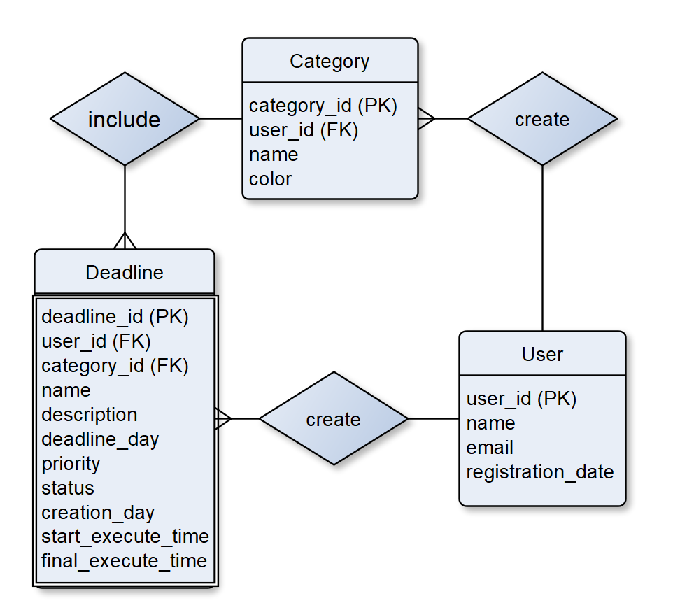

## 1. Название проекта

**NewLine**

## 2. Краткое описание идеи проекта

Приложение NewLine предназначено для хранения и управления дедлайнами пользователя. Оно помогает планировать задачи и контролировать сроки выполнения. Также оно анализирует время выполнения задач (Cycle Time) пользователями и их загруженность делами.

## 3. Краткое описание предметной области

Приложение предназначено для управления дедлайнами пользователей. Оно позволяет добавлять, отслеживать выполнение задач и получать аналитику о загруженности и продуктивности.

Предметная область включает в себя следующие сущности:

1. Пользователь
2. Дедлайн
3. Категория

Роли:

1. Пользователь

## 4. Краткий анализ аналогичних решений

| Название | Хранение дедлайнов | Cycle Time (CT) | Оценка загруженности |
| -------- | ------------------ | --------------- | -------------------- |
| Todoist  | +                  | -               | -                    |
| Trello   | +                  | -               | -                    |
| Any.do   | +                  | -               | -                    |
| NewLine  | +                  | +               | +                    |

## 5. Краткое обоснование целесообразности и актуальности проекта

Современные пользователи нуждаются в удобном инструменте для управления задачами и дедлайнами. NewLine предлагает не только хранение дедлайнов, но и их анализ, что помогает пользователям эффективно распределять нагрузку и повышать продуктивность. Многие современные приложения перегружены лишними функциями, которыми большинство пользователей не пользуются. NewLine отличается простотой и концентрацией на основном функционале, что делает его удобным и интуитивно понятным для всех категорий пользователей.
Одним из ключевых преимуществ является удобное управление задачами с помощью методологии Kanban. Пользователь может распределять свои дедлайны по статусам "todo", "in_progress" и "done", что облегчает контроль за текущими и выполненными задачами как в личных проектах, так и в командной работе.

## 6. Use-Case - диаграмма

## 7. ER-диаграмма сущностей

## 8. Пользовательские сценарии

Пользователь может:

1. Авторизоваться
2. Выйти из аккаунта
3. Добавить задачу
4. Добавить категорию
5. Просмотреть все свои текущие задачи
6. Передвинуть задачу (todo->in_work->done)
7. Определить свою загруженность
8. Получить анализ времени выполнения задач (Cycle Time)

## 9. Уточнение ключевых сценариев

### **Сценарий 1: Добавление дедлайна**  

**Описание:** Пользователь хочет добавить новый дедлайн.  

**Шаги:**  
1. Пользователь открывает приложение и переходит в раздел "Добавить дедлайн".  
2. Вводит следующие данные:  
   - Заголовок дедлайна (**name**);
   - Описание (**description**);
   - Дата выполнения (**deadline_time**);  
   - Приоритет (**priority**).
3. Пользователь выбирает категорию дедлайна или создаёт новую (**category_id**).
3. Приложение автоматически сохраняет дату создания (**creation_time**).
4. Устанаавливается статус задачи "todo" (**status**).
4. Пользователь подтверждает добавление.  
5. Система проверяет корректность введенных данных.  
6. Дедлайн сохраняется в базе данных, привязываясь к **user_id**.  
7. Пользователь получает уведомление об успешном добавлении дедлайна.  

### **Сценарий 2: Определение загруженности пользователя**  

**Описание:** Пользователь хочет узнать свою загруженность за неделю с учетом распределения задач по дням и их приоритетам.  

### **Сценарий 3: Анализ времени выполнения задач (Cycle Time)**  

**Описание:** Пользователь хочет получить углубленный анализ своей продуктивности, включая динамику выполнения дедлайнов и расчет перцентилей Cycle Time (CT).

