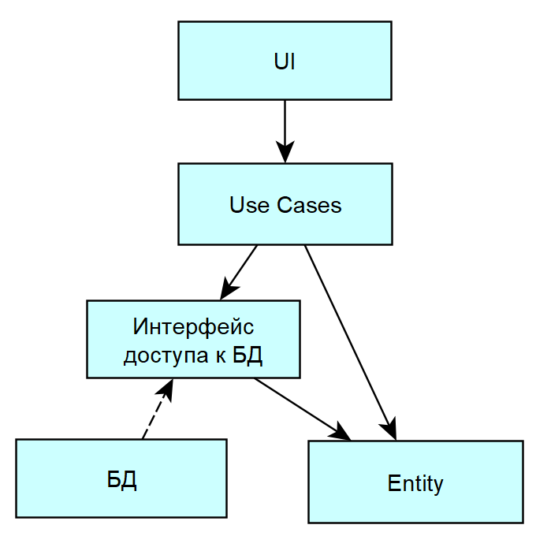
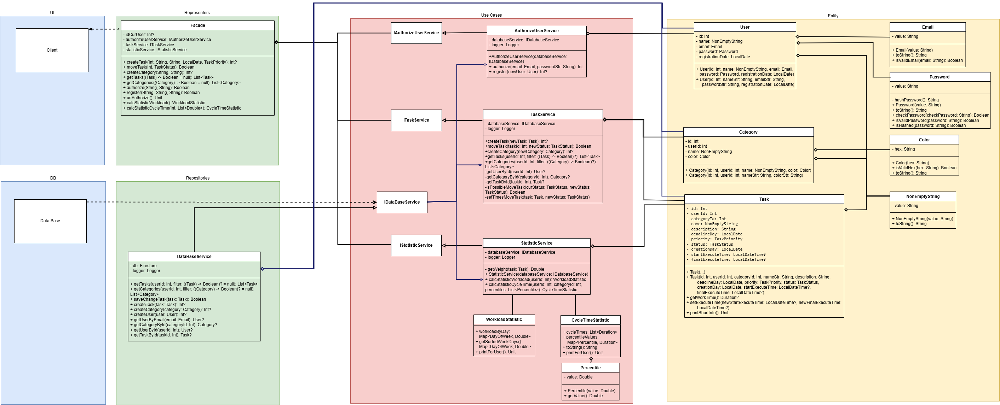

## 1. Tехнологический стек

- Тип приложения: Мобильное Android
- Язык программирования: Kotlin
- СУБД: Firebase

## 2. Верхнеуровневое разбиение на компоненты

На базовом уровне выделяем:

- Компонент реазации UI.
- Компонент реазации бизнес-логики (Business Logic).
- Компонент доступа к данным (Data Access).

# UML диаграмма компонентов

## 4. UML диаграмма классов

